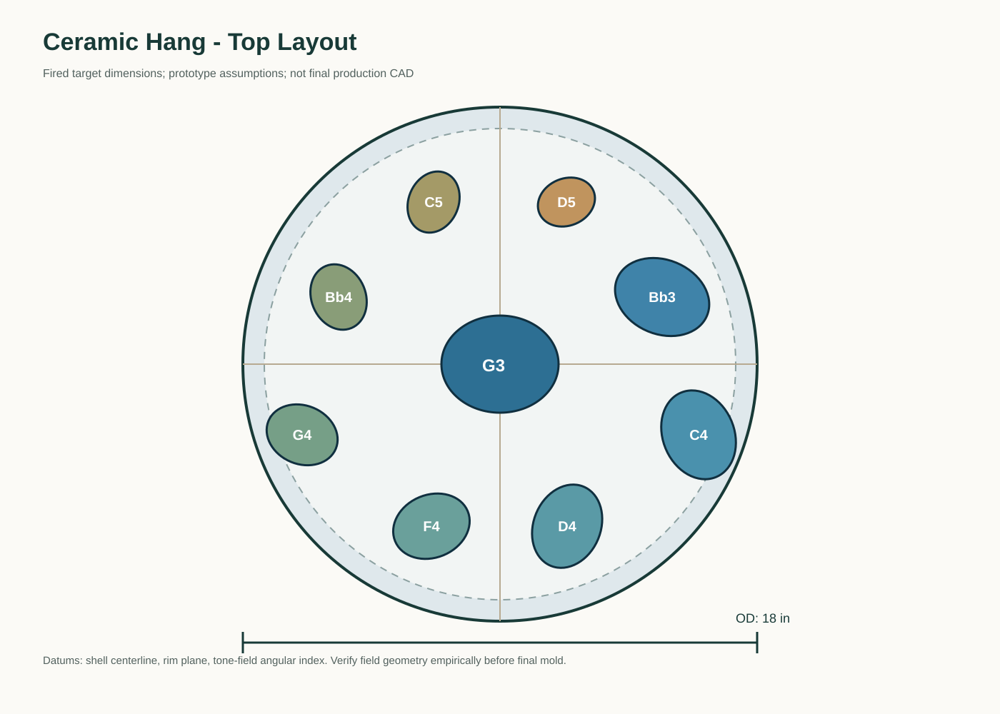
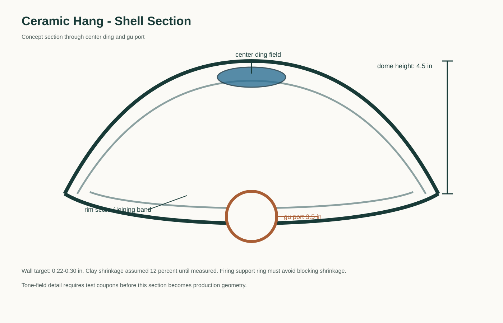
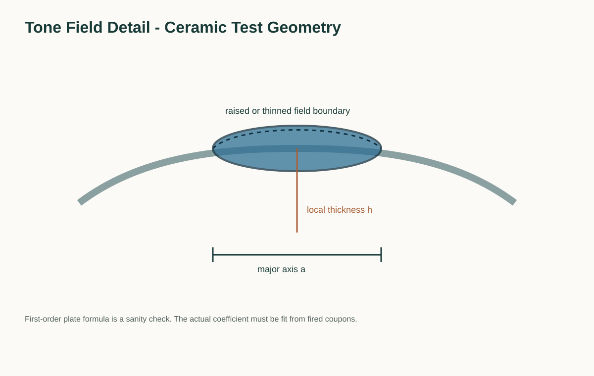
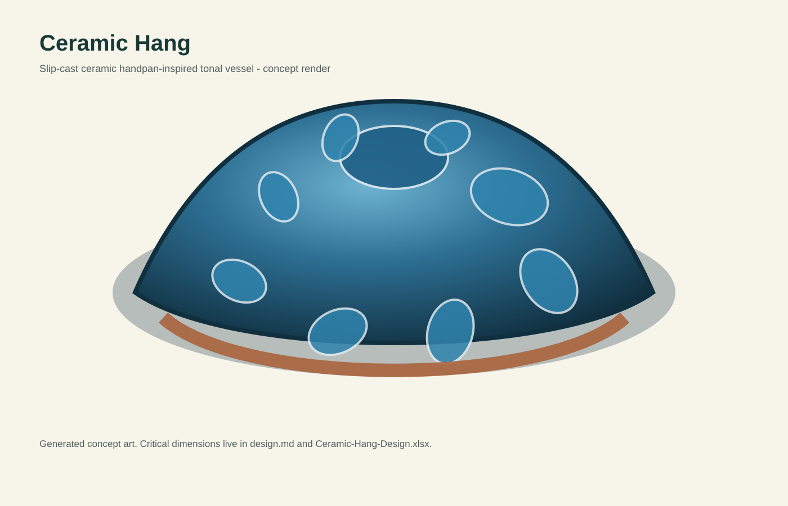

# Ceramic Hang Capstone
- Musical instrument documentation capstone
- Build packet: ceramic-hang
- Generated: 2026-05-06

---

# Project Intent
- Design a slip-cast ceramic, handpan-inspired tonal vessel that explores raised/isolated ceramic tone fields on a shallow resonant shell. The project is a research instrument first: the goal is to learn whether molded ceramic tone fields can produce musically useful fundamentals and partials after firing, and what clay body, wall thickness, tone-field geometry, and firing schedule make that repeatable.

_Speaker notes:_ Read design.md before committing to dimensions or sourcing decisions.

---

# Physics Model
- This instrument is governed by coupled plate/shell vibration plus Helmholtz body resonance.

```
tone_field_f1 ~= (kappa / (2*pi)) * (h / a^2) * sqrt(E / (rho * (1 - nu^2)))
```

```
f_gu = c/(2*pi) * sqrt(A_gu / (V_shell * L_eff_gu))
L_eff_gu = wall + 0.6 * sqrt(A_gu/pi)
```

_Speaker notes:_ Governing equations extracted verbatim from design.md. Apply empirical corrections (NAF K2, scale offsets) only where the model permits — see references/acoustic-models.md.

---

# How To Use This Packet
- Start with design.md for intent and assumptions.
- Use bom.csv, sourcing.csv, and cut-list.csv before buying or cutting.
- Use drawing-brief.md and CAD/CNC folders before machining.
- Print the packet for shopping, shop work, and validation.

---

# File Map
- design.md: Project intent, catalog metadata, assumptions, and validation plan.
- bom.csv: Starter bill of materials with part categories, quantities, drawing refs, and notes.
- sourcing.csv: Supplier/search tracker with specs, price/date fields, lead time, substitutes, and risks.
- cut-list.csv: Rough/final stock sizes, material, grain/orientation, operations, yield, and offcuts.
- drawing-brief.md: Manufacturing drawing and technical product sketch brief.
- assembly-manual.md: Shop-facing sequence, tools, fixtures, safety, tuning, finishing, and maintenance notes.
- validation.csv: Target/measured values, tolerance, environment, result, and tuning/build action log.
- supplier-rfq.md: Supplier email/request-for-quote starter.

---

# Family Spec

| member_id | name | outer_diameter_in | height_in | target_key | note_count | wall_target_in | gu_diameter_in | prototype_goal |
| --- | --- | --- | --- | --- | --- | --- | --- | --- |
| CHG-P1 | Mini 3-field coupon dome | 10 | 2.75 | G minor subset | 3 | 0.24 | 2.0 | Validate tone-field geometry on a small shell. |
| CHG-P2 | Full blank body | 18 | 4.5 | None | 0 | 0.26 | 3.5 | Validate casting/drying/firing and gu/body mode. |
| CHG-P3 | Five-note vessel | 18 | 4.5 | G minor pentatonic | 5 | 0.24 | 3.5 | First musical ceramic shell. |
| CHG-P4 | Nine-note G minor | 18 | 4.5 | G minor | 9 | 0.22-0.30 | 3.5 | Full handpan-inspired target. |
|  |  |  |  |  |  |  |  |  |

_Speaker notes:_ Sizes scale via the master scale factor; tuning targets are first-order Helmholtz/cantilever predictions to be empirically corrected per prototype.

---

# Build Workflow
- Design and assumptions
- Source materials and hardware
- Prepare stock, fixtures, and CNC/laser/lathe setup
- Assemble, tune, finish, and validate

---

# Sourcing And BOM
- BOM gives part categories and drawing references.
- Sourcing tracks search terms, supplier candidates, price/date, lead time, substitutions.
- Visual BOM brief turns the parts list into a presentation-ready image board.

---

# Shop Packet
- Cut list for lumber/sheet/blank planning.
- Assembly manual for away-from-keyboard work.
- Validation sheet for measured dimensions, tuning, pass/fail checks.

---

# Drawings, CAD, CNC
- drawing-brief.md defines required views, dimensions, datums, sketch intent.
- cad/ holds models and design tables.
- cnc/ holds CAM, toolpaths, setup sheets, dry-run notes.
- drawings/ holds PDFs, SVGs, DXFs, drawing exports.





---

# Images And Screenshots
- images/hero-concept.svg



---

# Validation Plan
- A4 = 440 Hz reference check.
- Tuning targets logged in validation.csv.
- Critical dimensions verified against design sheet and CAD.
- Photos and revision notes after each major step.

---

# Open Risks / Decisions
- TBDs in design sheet and BOM.
- Supplier price/availability not yet verified.
- Generated images marked as concept placeholders.
- Empirical corrections await measured prototype data.

---

# Next Actions
- Replace TBDs with measured/source-backed values.
- Verify live supplier price and availability before buying.
- Export final drawings and visual BOM images.
- Regenerate this deck and print packet after final edits.

---
